# 🚗 Predictive Modeling for Used Car Pricing
> ——*A Machine Learning Project*

**Student**: [Will Zhong]  
**Course**: [ISOM 835 Machine Learning]  
**Instructor**: [Hasan Arslan]  
**Date**: [05/2025]


---

## 📌 Project Overview  

This project applies machine learning to help used car dealerships optimize pricing strategies.  
Using a comprehensive dataset of historical vehicle transactions, the objective is to develop predictive models that estimate the fair market value of a used car based on key features, including:

- Make, model, and year  
- Condition and odometer reading  
- Manheim Market Report (MMR) value  
- Final selling price  

By leveraging supervised regression techniques, the project aims to identify the most influential pricing factors, evaluate model accuracy, and assess generalizability across different vehicle categories. The ultimate goal is to provide actionable insights to support data-driven pricing and inventory decisions.

## 🎯 Expected Outcomes

- **Identify the most influential features**—such as MMR, condition, and odometer—that drive used vehicle pricing decisions.
- **Build and evaluate high-performing ML models** (e.g., XGBoost, LightGBM) to accurately predict vehicle selling prices with minimal error.
- **Assess model fairness and generalization** across key subgroups (e.g., SUVs vs. others, Japanese vs. non-Japanese brands), ensuring pricing models are reliable and unbiased.
- **Provide data-driven recommendations** to support smarter pricing, inventory sourcing, and model deployment in real-world business settings.

---

## Introduction & Dataset Description

In today’s used vehicle market, pricing strategies must be both dynamic and data-driven. Consumers seek fair prices while dealerships aim for profitability. To bridge this gap, predictive analytics can play a critical role in estimating fair market values of used cars. This project applies supervised machine learning techniques to a large-scale dataset of historical vehicle transactions to build a regression model that predicts used car selling prices based on a variety of features. The goal is to support used car dealerships in making informed pricing decisions and identifying patterns in consumer behavior.

### Dataset Overview

The dataset used in this project is the **"Vehicle Sales and Market Trends Dataset"**, originally published on [Kaggle](https://www.kaggle.com/datasets/syedanwarafridi/vehicle-sales-data/data). It contains detailed information on **558,837** used vehicle transactions, with **16 columns** describing each vehicle's specifications, condition, market benchmarks, and final selling price.

This real-world dataset provides a strong foundation for building predictive machine learning models to estimate used car prices — a task of direct business relevance to auto dealers, resale platforms, and pricing analysts.

### Dataset Summary


| Attribute                    | Value                    |
|-----------------------------|--------------------------|
| 📠Dataset Name             | Vehicle Sales and Market Trends |
| 🔢 Number of Rows           | 558,837                  |
| 🔠 Number of Columns        | 16                       |
| 🧾 File Format              | CSV                      |
| 🔠Update Frequency         | Periodically             |
| ✅ Data Integrity           | Reasonable quality, but further validation recommended |


### Dataset Features


The dataset includes a wide range of attributes that influence vehicle valuation:

- **Vehicle Details**: `make`, `model`, `year`, `trim`, `body type`, `transmission`, `VIN`
- **Condition & Mileage**: `condition`, `odometer`, `exterior_color`, `interior_color`
- **Transaction Info**: `sellingprice`, `date`, `state`, `seller`
- **Market Benchmark**: `mmr` (Manheim Market Report), which provides an industry pricing baseline


| **Column**       | **Description**                                                                 |
|------------------|----------------------------------------------------------------------------------|
| `year`           | Year of the vehicle                                                             |
| `make`           | Manufacturer brand (e.g., BMW, Toyota)                                          |
| `model`          | Specific model name                                                             |
| `trim`           | Trim level                                                                      |
| `body`           | Body type (e.g., SUV, Sedan)                                                    |
| `transmission`   | Transmission type (manual or automatic)                                         |
| `condition`      | Numeric condition rating (subjective or appraised)                              |
| `odometer`       | Mileage reading at time of sale                                                 |
| `color`          | Exterior color                                                                  |
| `interior`       | Interior color                                                                  |
| `seller`         | Selling party or dealer name                                                    |
| `mmr`            | Manheim Market Report value (benchmark vehicle price)                           |
| `sellingprice`   | Final sale price of the vehicle                                                 |
| `saledate`       | Timestamp of the sale transaction                                               |


### Summary Statistics

| Metric                     | Value     |
|---------------------------|-----------|
| Number of rows            | 558,837   |
| Number of columns         | 16        |
| Mean vehicle year         | 2010.0    |
| Mean odometer             | 68,320    |
| Mean condition            | 30.67     |
| MMR (avg)                 | $13,769   |
| Selling Price (avg)       | $13,611   |


### Sample Data Variety

Below are a few randomly sampled entries from different years, states, and sellers to illustrate the dataset’s diversity:

| year | make   | model     | state | condition | odometer | mmr   | sellingprice |
|------|--------|-----------|-------|-----------|----------|-------|---------------|
| 2013 | Ford   | Escape    | TX    | 4.0       | 17,098   | 16400 | 16700         |
| 2002 | Nissan | Sentra    | FL    | 36.0      | 85,538   | 1900  | 2500          |
| 2012 | Kia    | Optima    | PA    | 47.0      | 33,002   | 14500 | 15300         |
| 2011 | BMW    | 3 Series  | NJ    | 44.0      | 37,196   | 19650 | 18800         |


### Why This Dataset?

This dataset was selected for the following reasons:

- **Practical Business Relevance**: Used car pricing is a key challenge in auto sales and inventory management.
- **Rich Feature Set**: Includes both vehicle-level details and market-level signals (e.g., MMR).
- **Real-World Scale**: With over half a million records, it supports robust training, validation, and generalization.
- **Model Interpretability**: The presence of interpretable features like condition, mileage, and brand enables clear insights from ML models.


### Potential Use Cases

- ** Market Analysis**: Track pricing trends by year, region, or vehicle type.
- ** Predictive Modeling**: Build regression models to estimate car values.
- ** Business Strategy**: Support pricing, sourcing, and resale decisions with data-driven insights.
- ** Customer Profiling**: Understand patterns in buying behavior or vehicle depreciation.


### Project Relevance

This project applies supervised regression techniques to:

- Predict the **selling price** of a used vehicle based on its attributes
- Identify the **key drivers** of price variation (e.g., MMR, condition, mileage)
- Evaluate model performance across different **vehicle subgroups** (e.g., by category or brand)

The ultimate goal is to deliver actionable insights that support smarter, data-driven decisions for **used car dealerships** and **resale platforms**.


## Exploratory Data Analysis (EDA)

### Distribution of Categorical Features

The following chart presents the frequency distributions of key categorical features in the dataset:


Key Takeaways:

- **Make**: Ford, Chevrolet, and Nissan are the most frequently listed brands, representing a large portion of the dataset.
- **Body Type**: Sedans and SUVs dominate the vehicle body types, while coupes, convertibles, and wagons are less common.
- **Transmission**: Most vehicles use automatic transmission, suggesting potential simplification in modeling.
- **State**: Florida and California contribute the most records, indicating possible regional market trends.
- **Country of Origin**: Vehicles from the U.S. and Japan lead the dataset, with Germany a distant third.
- **Exterior & Interior Colors**: Black, white, and gray are dominant for both exterior and interior colors, suggesting consumer preferences.
- **Year Distribution**: The bulk of the vehicles were manufactured between 2010 and 2015, reflecting recency in resale activity.

These distributions provide important context for understanding the dataset composition and help inform preprocessing steps (e.g., rare category consolidation).

---

#### Top Vehicle Attributes (Categorical)

- **Top Makes**: Ford, Chevrolet, Nissan, Toyota, Honda.
- **Top Body Types**: Sedans and SUVs dominate.
- **Transmission Types**: Majority are automatic.
- **Top States**: FL, CA, PA, TX have the most listings.

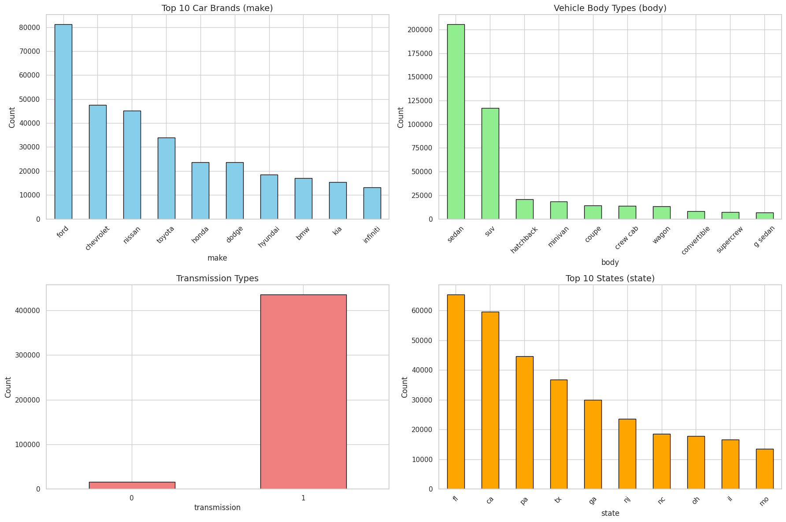


---

#### Distribution by Category

- **Country of Origin**: U.S.-made vehicles dominate the dataset, followed by Japan and Germany.
- **Vehicle Type**: Sedans and SUVs account for the majority; pickup trucks and minivans are fewer.
- **Vehicle Color**: Black, white, silver, and gray are the most common exterior colors.
- **Interior Color**: Black and gray dominate interior designs, indicating market preference.

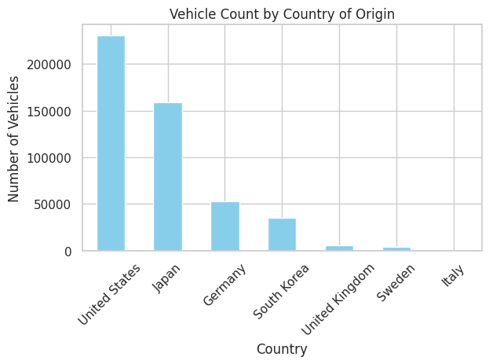
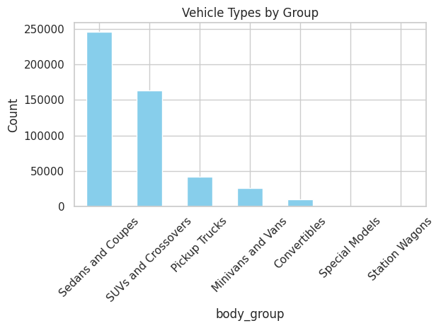
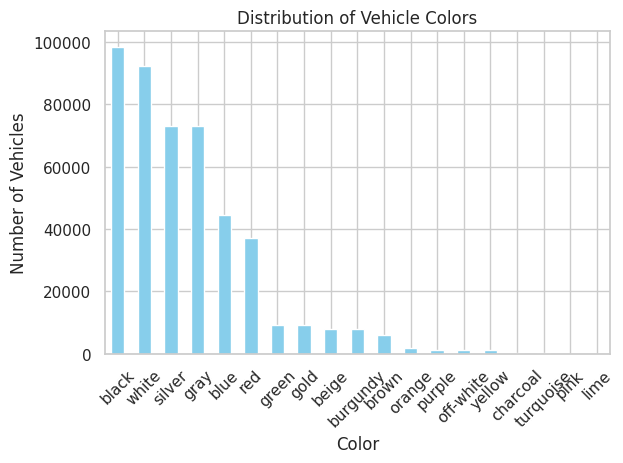
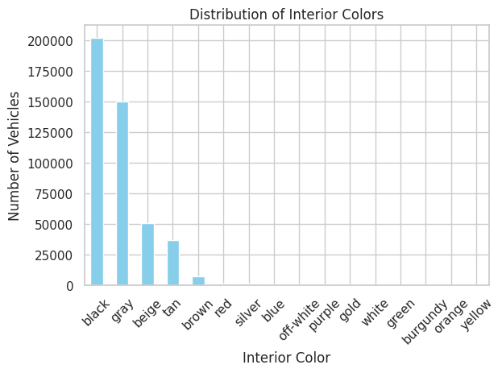

---


#### Vehicle Transmission Breakdown

- Automatic transmissions (encoded as `1`) account for more than **96%** of all entries, reinforcing the dominance of automatics in the U.S. used vehicle market. Manual vehicles are rare in this dataset.

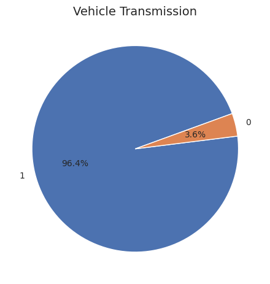

---

### Distribution of Key Numerical Features

#### Distribution of Selling Price Odometer and Odometer

- **Selling Price**: Right-skewed; most cars are priced between \$5,000 and \$20,000, with a long tail above \$100,000.
- **Odometer**: Positively skewed; most vehicles have mileage under 100,000 miles, but some outliers exceed 900,000.
- **Odometer (Market Benchmark Price)**: Also right-skewed, with values typically between \$5,000 and \$25,000.


---

#### Log-Transformed Distribution of Selling Prices

- Selling price is heavily right-skewed in raw form, with a long tail toward high-end vehicles.  
- After log transformation, the distribution becomes much more symmetric and bell-shaped, which benefits linear model assumptions.

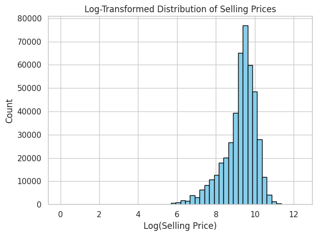


---

### Feature Relationships

---

#### Selling Price vs Numerical Features


##### Distribution of Selling Price vs Key Features

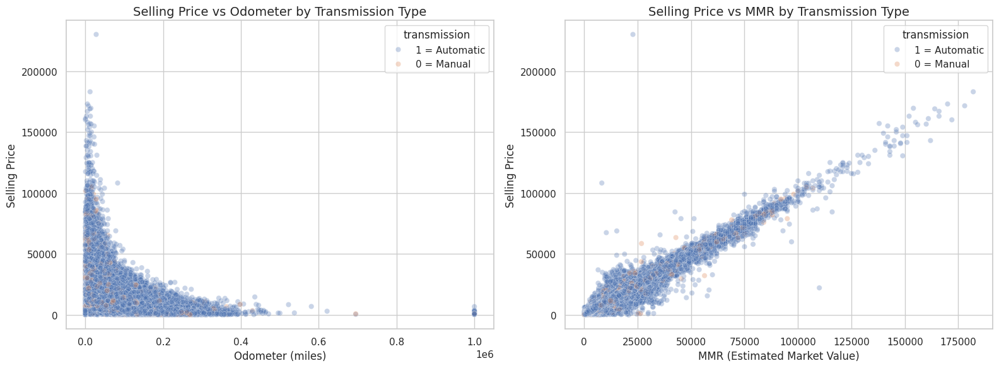

**Key Insights:**

- **Odometer**: There is a clear negative relationship—vehicles with lower mileage tend to command higher prices. Outliers with extremely low prices at high mileage levels are visible.  
- **MMR Value**: Strong positive correlation with selling price, indicating MMR is a reliable market benchmark for pricing.

---

##### Correlation Heatmap (Numerical Features)

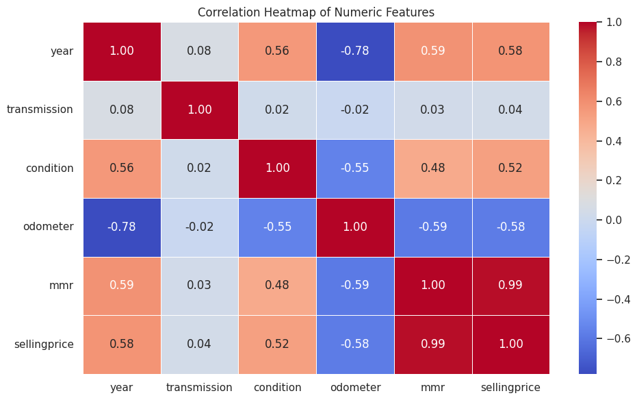

**Insights:**

- **MMR and Selling Price**: Nearly perfect positive correlation (0.99).  
- **Odometer and Selling Price**: Moderately negative correlation (–0.58), suggesting depreciation with use.  
- **Year** also positively correlates with price—newer vehicles are more valuable.

---


#### Selling Price vs Categorical Features

##### Boxplots of Selling Price by Category

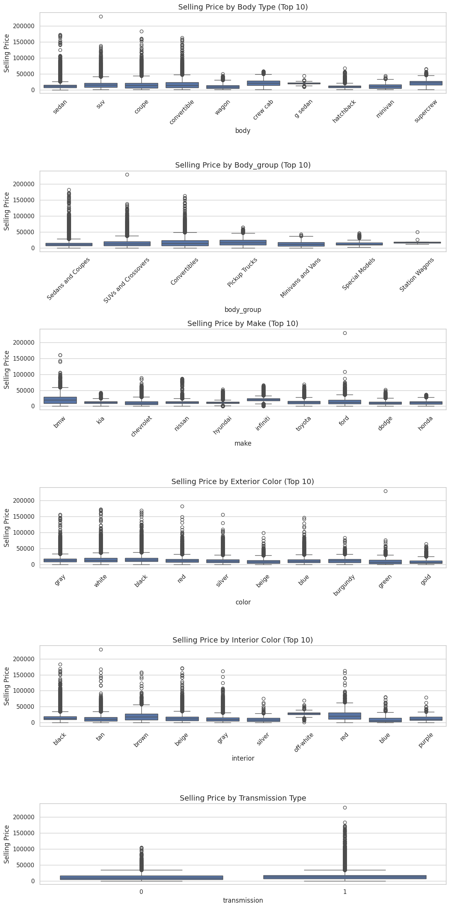

**Key Observations:**

- **Body Type**: Convertibles and coupes tend to have higher price ranges than minivans or hatchbacks.  
- **Brand (Make)**: Luxury brands like BMW and Infiniti show higher price distributions than others.  
- **Transmission**: Automatic vehicles dominate the dataset and exhibit a wide price spread.

---

##### Selling Price by Exterior Color

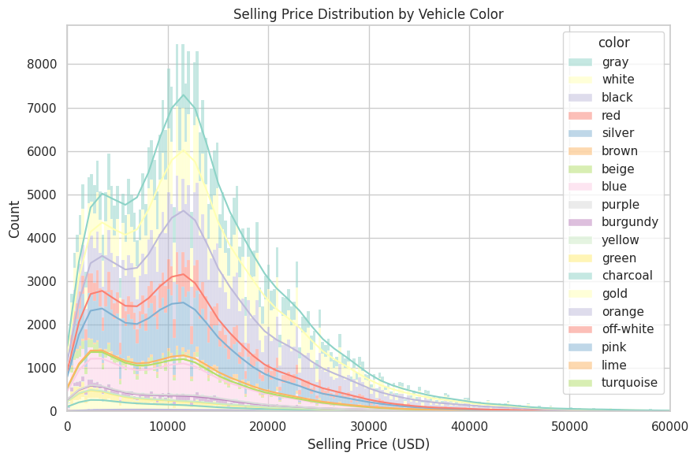

**Color-Based Behavior:**

- **Gray**, **white**, and **black** are the most common colors and span a wide price range.  
- Bright or niche colors (e.g., lime, turquoise) are associated with lower frequency and possibly more specialized pricing.

---

##### Selling Price by Interior Color

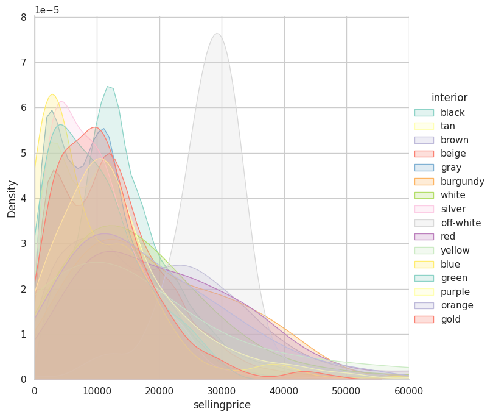

**Interior Preferences:**

- Black and beige interiors dominate volume.  
- **Off-white** shows a distinct price peak, indicating premium vehicle alignment.

---

##### Average Price by Exterior Color

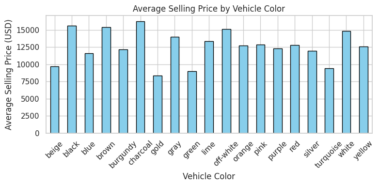

**Insight:**

- **Charcoal**, **off-white**, and **black** tend to fetch higher average prices.  
- **Gold**, **white**, and **green** see lower average prices.

---

##### Average Price by Interior Color

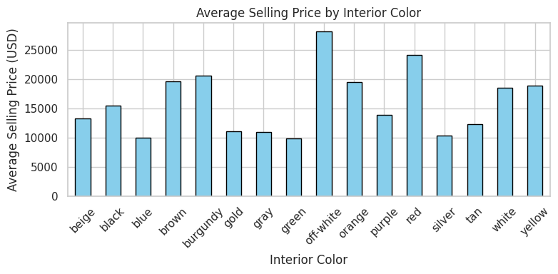

**Observation:**

- **Off-white** interiors show a much higher average price—often a sign of luxury branding.  
- **Tan** and **blue** interiors correspond with lower average prices.

---
##### Top Brands with Off-White Interiors

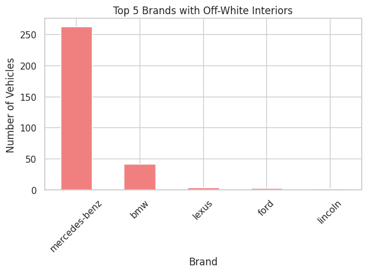

**Insight:**

- **Mercedes-Benz** dominates the vehicles featuring off-white interiors, consistent with premium design choices.  
- Other luxury brands like **BMW** and **Lexus** appear but in much smaller counts.

---


#### Categorical vs Categorical Associations

##### Categorical Relationships (Cramér’s V)

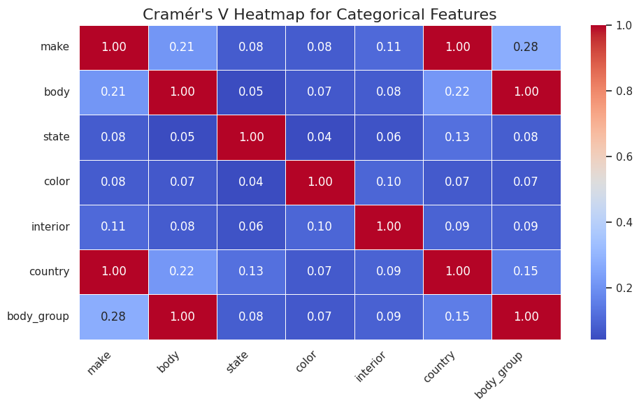

**Takeaways:**

- Strong association between **make** and **country**, and between **body** and **body_group**.  
- Most other categorical relationships are weak, suggesting minimal multicollinearity concerns.

---

### Time-based Trends

#### Monthly Sales Trend

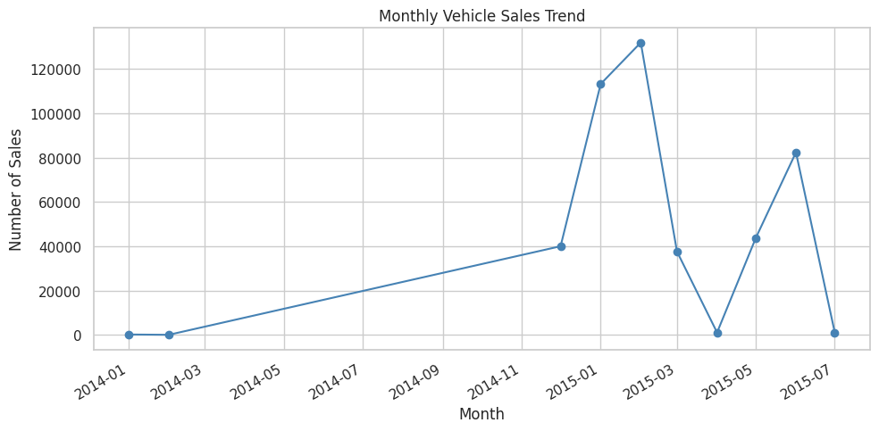

**Trend Observation:**

- Vehicle sales peaked around early 2015, indicating seasonal or market-driven patterns worth further business analysis.

---

### Summary of EDA

My exploratory analysis revealed several key insights:

- **Price Drivers**: Vehicle age (year), mileage (odometer), and market benchmark (MMR) are strongly associated with selling price, with MMR showing the highest correlation.
- **Category Patterns**: Body type, brand, and color exhibit notable price differences—luxury brands and niche colors often correlate with higher prices.
- **Market Skew**: Selling price, MMR, and odometer all show right-skewed distributions, suggesting the presence of high-end and high-mileage outliers.
- **Transmission Trends**: Automatic vehicles dominate the dataset and show a wide range in selling prices.
- **Temporal Variation**: Sales volume peaked in early 2015, potentially due to seasonal or economic trends.

These findings not only help shape our preprocessing and feature selection strategy, but also validate the dataset’s suitability for supervised learning and regression modeling.


---

## Data Cleaning and Preprocessing

---

### Duplicate & Missing Value Handling

- **Duplicate Check**: No duplicate rows found in the dataset.
- **Missing Value Check**:  
  - Columns with missing values were identified and visualized using bar charts, matrix charts, and heatmaps.
  - Low-missing columns (less than 1%) were handled via listwise deletion.
  - High-missing categorical columns were imputed using mode values.
  - Final check confirmed that missing values were fully addressed.

---

### Frequency & Categorical Value Checks

- **Frequency Check**: Categorical features were examined for unusual or rare values.
- **Discrete-Type Detection**: Identified variables with finite, interpretable value sets.
- **Categorical Frequency Summary**: Provided an overview of distribution across major categorical features.

---

### Categorical Feature Cleaning & Normalization

- **Column Standardization**:
  - `make` was mapped to its corresponding `country` (e.g., Ford → United States).
  - `body` types were grouped into body groups (e.g., coupe, sedan → Sedans and Coupes).
- **Text Normalization**:
  - Cleaned inconsistencies in `color` and `interior` columns (e.g., standardizing casing, removing whitespace).
  - Transmission values (e.g., 'A', 'Automatic') were encoded as binary.

---

### Outlier Detection

Box Plot Insights: Vehicle Features & Selling Price

1. **Model Year & Condition**
- **`year`**: Most vehicles are manufactured between **2010–2014**, with a few **older outliers** (pre-2000).
- **`condition`**: Fairly **evenly distributed**, centered around average values. No major outliers, suggesting condition scores are relatively stable across vehicles.

2. **Odometer**
- Shows a **heavily right-skewed** distribution.
- **Outliers above 300,000 miles** are prevalent, with some extreme values exceeding **900,000+ miles**.
- Consider **capping or trimming** the top 1% to reduce skewness and improve model robustness.

3. **MMR (Market-Based Reference Price)**
- Dominated by outliers above **$75,000**, with a long right tail.
- This feature likely represents **industry reference benchmarks** but contains values far beyond the majority.
- Consider applying **log transformation** or **capping** at a reasonable upper bound (e.g., 99th percentile).

4. **Selling Price**
- Highly **right-skewed** with numerous **extreme outliers** above **$100,000** and even **$200,000+**.
- Consider applying **log transformation** or **capping** at a reasonable upper bound (e.g., 99th percentile).

>Proposed Action Plan
>
>Apply **outlier treatment (e.g., quantile-based trimming)** or **transformation (e.g., log)** to `odometer`, `mmr`, and `sellingprice` to enhance model training and interpretability.


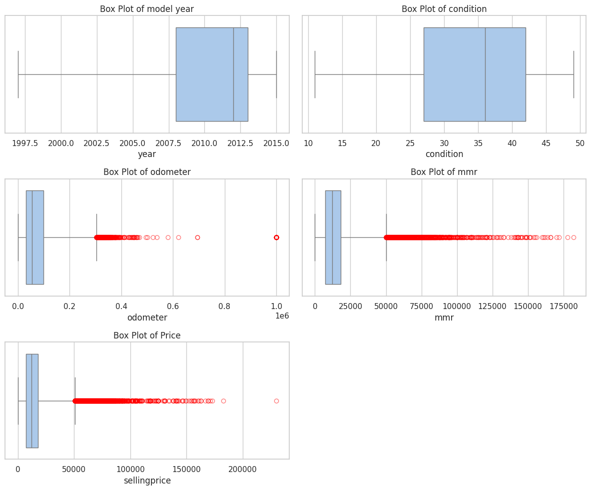

**Insights:**

- **Odometer**, **MMR**, and **Selling Price** exhibit strong right-skewed distributions with substantial outliers.
- **Year** and **Condition** show relatively symmetric distributions with fewer extreme values.
- Visualizing these helps determine which variables need capping to improve model robustness.

---

### Outlier Summary (IQR-based Detection)

**Outlier Count and Percentage per Feature:**

- **mmr**: 2,523 outliers (0.56%)
- **sellingprice**: 2,361 outliers (0.52%)
- **odometer**: 424 outliers (0.09%)
- **year**: 0 outliers (0.00%)
- **condition**: 0 outliers (0.00%)

**Selected Features for Treatment**:  
`['mmr', 'sellingprice', 'odometer']`

**Key Insights:**

- Although **mmr** and **sellingprice** exhibit long tails, their outlier rates are under 1%, implying they are rare but potentially impactful.
- **odometer** has fewer outliers, yet these can still distort model training.
- **year** and **condition** are clean and stable with no detected outliers.

**Actionable Plan:**

- Either **retain** the outliers when using robust models (e.g., Gradient Boosting), or  
- Apply **capping** (e.g., 1st–99th percentile) to minimize the influence of extreme values and enhance model generalizability.

---

### Apply Capping to Selected Columns

#### Applied Method: 1st–99th Percentile Capping

To address extreme outliers without sacrificing data completeness, I applied **percentile-based capping**:

- **Method**: 1st–99th percentile capping  
- **Goal**: Limit the influence of extreme values while preserving all rows
- **Capping Applied To**:  `['mmr', 'sellingprice', 'odometer']`

#### Why 1st–99th Percentile?

- Retains **most data points**, ensuring downstream model performance is not compromised.
- Especially suitable for **right-skewed distributions** like price and mileage.
- Helps maintain **row count consistency**, which is crucial for dashboarding and time-based analyses.

#### Key Observations from Box Plots:

- **MMR and Selling Price**: Originally had long-tailed outliers, now capped to reflect more realistic market values.
- **Odometer**: Extremely high mileage vehicles (e.g., > 500,000 miles) were capped, improving scale uniformity.
- **Distribution Shape**: The core IQR structure remains intact, preserving meaningful variation for modeling.

**Outcome**:

- Outliers were effectively **capped** rather than removed.
- This approach **preserves row count and data structure**, ensuring minimal information loss while reducing the distortion from extreme values.
- Post-capping boxplots confirm that the majority of extreme outliers were compressed into the whisker range.

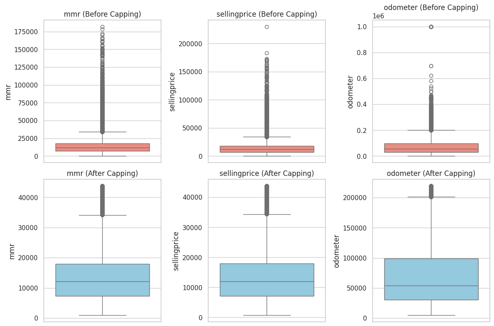

**Takeaways:**

- After applying percentile-based capping (1st–99th percentile), extreme outliers are removed without distorting the core distribution.
- This transformation reduces the influence of rare but extreme values in **mmr**, **odometer**, and **sellingprice**, which is crucial for stable model training.

---

### One-Hot Encoding

To prepare the dataset for machine learning algorithms, I applied **One-Hot Encoding** to convert categorical variables into binary features.

#### Feature Engineering Steps:

- Converted `saledate` to datetime format and extracted **weekday** (`1–7`) as a new temporal feature.
- Replaced original columns for better semantic clarity:
  - `make` was replaced with `country` to focus on **vehicle origin**.
  - `body` was replaced with `body_group` to generalize **vehicle types**.

#### Encoded Categorical Columns:

- `body` → One-hot encoded as `Cat_*`
- `make` (country) → One-hot encoded as `Brand_*`
- `color` (exterior) → One-hot encoded as `C_*`
- `interior` (interior material) → One-hot encoded as `I_*`

#### Output:

- **Dummy columns** were cast to `int64` for full compatibility with ML models.
- **Final dataset shape**: e.g., `(451,244, 58)` — includes all one-hot encoded features.

One-hot encoding expands categorical features into numeric binary vectors, enabling regression and tree-based models to capture category effects.

#### Final Encodings Summary

- One-hot encoding was applied to key categorical columns: `body`, `make`, `color`, and `interior`.
- Ensured all dummy variables were converted to `int64` for model compatibility.
- A new feature `weekday` was created from `saledate` to capture potential day-of-week effects.

Final cleaned dataset saved as: `one_hot_cleaned_car_prices_for_modeling.csv`

---

### Feature Selection and Preparation

---

#### Retained Features (10)

To balance model accuracy and interpretability, we selected the top 10 most relevant features based on exploratory analysis, box plots, and correlation heatmaps:

| Feature             | Description                                               |
|---------------------|-----------------------------------------------------------|
| `year`              | Newer vehicles usually command higher resale value        |
| `condition`         | Better condition positively correlates with price         |
| `odometer`          | Higher mileage generally reduces price                    |
| `mmr`               | Manheim Market Report value – a strong price benchmark    |
| `Cat_Pickup Trucks` | Key body type category                                    |
| `Cat_Sedans and Coupes` | Another major body type segment                      |
| `Brand_Germany`     | Captures premium brand influence (e.g., BMW, Mercedes)    |
| `C_black`           | Most common exterior color                                |
| `I_black`           | Dominant interior color                                   |
| `I_gray`            | Popular interior tone                                     |

These variables, along with the target variable `sellingprice`, were retained to form the final modeling dataset. All other variables were dropped to reduce noise and multicollinearity.

---

#### Final Feature Correlation Heatmap

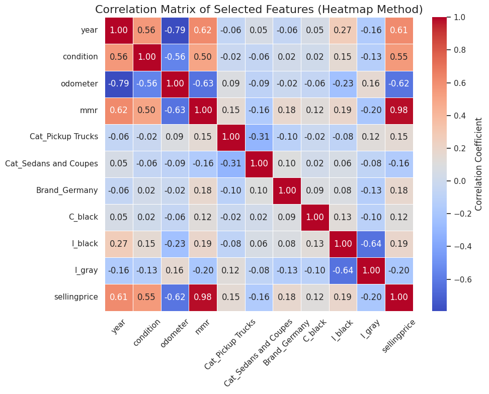

**Insights:**

- **MMR (0.98)** shows an almost perfect linear relationship with `sellingprice`.
- **Year (0.61)** and **condition (0.55)** also contribute significantly.
- **Odometer** presents a strong negative relationship (–0.62), aligning with depreciation trends.
- Other categorical indicators (e.g., color, brand, body) have moderate but meaningful associations.

These findings validate the selected features as meaningful predictors of vehicle price.


---


### Formulating Business Analytics Questions

---

#### 1. Which factors most significantly influence the selling price of used vehicles?

**Why it matters:**  
Understanding what drives pricing helps dealers, resellers, and analysts make smarter pricing and sourcing decisions. It also increases transparency for customers.

**How it connects to the data:**  
By analyzing model-based feature importance (e.g., from Gradient Boosting or XGBoost), we can identify which variables—such as `mmr`, `condition`, `odometer`, `year`, or `brand`—most affect price.

**Expected outcome:**  
A ranked list of influential features based on their predictive importance in determining vehicle selling price.

---

#### 2. How accurately can the selling price of a vehicle be predicted based on its features?

**Why it matters:**  
Accurate predictions support automated pricing tools, better inventory valuation, and competitive strategy.

**How it connects to the data:**  
Using detailed features like `mmr`, `condition`, and `brand`, regression models can be trained and evaluated. Model performance will be assessed using metrics such as R², RMSE, and MAE.

**Expected outcome:**  
A summary of prediction accuracy and comparison across top-performing models (e.g., Gradient Boosting, LightGBM, XGBoost), validating overall reliability.

---

#### 3. How well does the predictive model generalize across different vehicle categories or brands?

**Why it matters:**  
Consistent performance across categories is critical for business deployment. Uneven accuracy may lead to unfair pricing or business risk.

**How it connects to the data:**  
By segmenting results by vehicle body type (e.g., SUV vs Other) or brand origin (e.g., Japanese vs Others), we can analyze accuracy trends and residuals across subgroups.

**Expected outcome:**  
Insights into where the model performs best or needs refinement, ensuring balanced performance across vehicle segments.

---

## Predictive Modeling 

---

### Defining Functions: Model Selection, Validation & Comparison

I defined reusable functions to automate model training, cross-validation, evaluation, and comparison across multiple regressors. These functions help streamline the modeling workflow and ensure consistency.

- `evaluate_models_pipeline()`  
- `compare_and_select_best_models()`  
- `cross_validate_model()`
- `compare_and_select_best_models()`
- `save_model_with_params()`
- `evaluate_models_pipeline()`
- `SmartModelSelector` 

These tools support both baseline and tuned models, and provide metrics such as **R²**, **MAE**, **MSE**, and **RMSE** for comparison.

---

### Feature Selection and Preparation

#### Data Checking and Reloading

Before feature selection, I checked the cleaned dataset to ensure all preprocessing steps were applied correctly and no transformations were missing.

#### Lasso Regression for Feature Importance

To select the most predictive features, I used **Lasso Regression**:

- Automatically penalizes less important variables by shrinking their coefficients to zero
- Helps improve generalization by reducing overfitting

Key steps:

- Standardized input features
- Used cross-validation to determine optimal regularization strength (`alpha`)
- Visualized Lasso coefficients to guide final selection

#### Final Feature Selection

Based on Lasso results and domain relevance, I selected the following 8 features for final modeling:

🔹 Selected Features:
1. year
2. Cat_SUVs and Crossovers
3. odometer
4. weekday
5. Brand_Japan
6. C_white
7. condition
8. mmr

These features, combined with the target `sellingprice`, form the final modeling dataset.
The final modeling dataset, containing the selected 10 key features and the target variable `sellingprice`, was saved as: final_selected_car_prices_for_modeling.csv

### Data Preparation for Modeling

#### Data Checking Before Selecting

To prevent data mismatch or loss due to session interruptions (e.g., in Colab environments), I reloaded and revalidated the final dataset before proceeding with feature selection and scaling.

This step ensured:

- No shape inconsistencies
- No unexpected missing values
- All selected features remained available and correctly typed

By doing so, I guaranteed a clean and stable base for downstream modeling tasks.

#### Manual Feature Set Selection (Optional Step)

Although the final modeling used features selected via Lasso and correlation analysis, I also implemented an optional manual selection step.

**Purpose:**

- To allow flexibility for modeling with alternative datasets or domain-specific feature sets.
- To provide a checkpoint where business logic or new hypotheses can guide feature refinement.

This step is especially helpful for experimenting with different feature combinations in future iterations or business-specific models.

#### Data Scaling & Train-Test Split

- Applied MinMaxScaler / StandardScaler to normalize numeric features
- Split dataset into **training (80%)** and **test (20%)** subsets with `random_state=42` for reproducibility

This dataset is fully preprocessed and feature-selected, ready for training and evaluation across various regression models.

---

### Unified Modeling and Model Comparison

---

#### Overview

To establish a benchmark and select the most robust regression model, I trained and evaluated six models:

- Linear Regression  
- Random Forest  
- Gradient Boosting  
- HistGradientBoosting  
- LightGBM  
- XGBoost  

Each model was assessed based on training and test performance metrics, including R², MSE, RMSE, and MAE. The goal was to identify high-performing models that generalize well and avoid overfitting.


| Model                | Train R² | Test R² | Test RMSE | Overfit Gap |
|---------------------|----------|---------|------------|--------------|
| **LightGBM**         | 0.9764   | 0.9763  | 0.1539     | **0.0001**   |
| HistGradientBoosting| 0.9763   | 0.9762  | 0.1540     | 0.0001       |
| XGBoost             | 0.9774   | 0.9760  | 0.1548     | 0.0014       |
| Gradient Boosting   | 0.9756   | 0.9757  | 0.1556     | -0.0001      |
| Linear Regression   | 0.9746   | 0.9747  | 0.1595     | -0.0001      |
| Random Forest       | 0.9963   | 0.9738  | 0.1618     | **0.0225**   |

---

#### Test Performance Comparison (Bar Charts)

To visually compare model generalization on unseen data, I plotted four bar charts based on test set results:

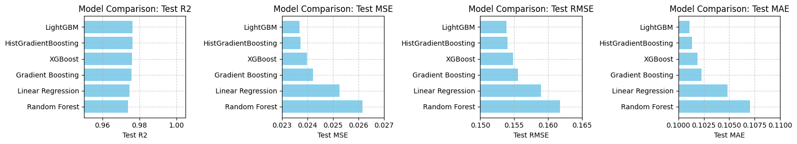

**Observations:**

- **Test R²**: LightGBM, HistGradientBoosting, and XGBoost show the highest explanatory power.
- **Test MSE & RMSE**: LightGBM leads with the lowest error, closely followed by HistGradientBoosting.
- **Test MAE**: All boosting models outperform linear and random forest in absolute prediction accuracy.

These charts reinforce the earlier ranking and help validate model consistency across different error metrics.

---

#### Performance Summary, Overfitting and Generalization Analysis

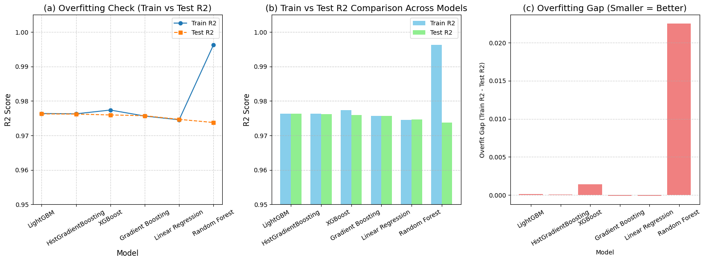

**Insights:**

- **LightGBM** and **HistGradientBoosting** show the best balance between accuracy and generalization, with minimal overfit.
- **Random Forest** achieves a high training R² but overfits significantly, as seen from the large test gap.
- **Gradient Boosting** and **Linear Regression** perform consistently with small gaps and stable R² values.
- **XGBoost** performs well, but with a slightly higher overfit gap than LightGBM.

**LightGBM** was selected as the most balanced and reliable model, offering excellent predictive power with minimal overfitting risk.

All models were evaluated using `SmartModelSelector` and `evaluate_models_pipeline()` to ensure consistent comparison and metric tracking across training and testing phases.


### Per-Model Fine-Tuning

#### Model Tuning and Selection Strategy

I trained and evaluated six regression models:

- Linear Regression  
- Random Forest  
- Gradient Boosting  
- LightGBM  
- XGBoost  
- HistGradientBoosting  

All models underwent baseline training and multi-stage hyperparameter tuning (Halving Search → Randomized Search → Grid Search).  
However, to maintain clarity and focus in this report, I present **detailed analysis only for the top-performing models**, while briefly summarizing the rest in the comparison section.


#### Selected Models for In-Depth Analysis

Among all six trained models, three stood out in terms of both predictive accuracy and generalization performance:

- **Gradient Boosting Regressor (GBR)** achieved the **highest R² (0.9764)** with very low RMSE and MAE.
- **LightGBM (GridSearch)** matched GBR in performance while maintaining the smallest overfit gap.
- **HistGradientBoosting (HistGB)** demonstrated **excellent generalization** with the **lowest overfit gap (0.0002)**.

These models are selected for detailed interpretation in the following sections.

While Gradient Boosting delivered the highest R² score (0.9764), **LightGBM achieved nearly identical performance** (R² = 0.9763, RMSE = 0.1536, MAE = 0.1008) with one key advantage: **speed**.

- **Training Efficiency**: LightGBM uses a histogram-based algorithm and leaf-wise tree growth, making it **much faster** than traditional Gradient Boosting.
- **Scalability**: It handles large datasets efficiently, making it suitable for real-world production environments.
- **Overfitting Control**: The model maintained a low overfit gap (0.0008), demonstrating strong generalization.

Given its balance of **accuracy, speed, and robustness**, LightGBM is a **top choice for deployment and further optimization**.

### LightGBM Modeling Workflow

#### 1. Baseline Model — LightGBM Regressor

A baseline LightGBM model was trained with default parameters to establish a performance reference. Despite no tuning, the model achieved strong R² and MAE scores, confirming LightGBM’s reliability on this dataset.

- **Train R²**: 0.9764  **Test R²**: 0.9763  
- **Test MAE**: 0.1011  **Test RMSE**: 0.1539  

The following plot shows the model's predictions vs. actual selling prices:

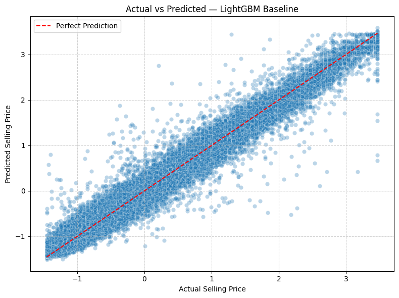

**Insight:**  
Predictions align closely with actual values, clustering around the diagonal line. Minor deviations appear at extreme values but are acceptable at baseline.


---

#### 2. Feature Importance — LightGBM Regressor

Before hyperparameter tuning, a feature importance analysis was conducted to understand which features most strongly influence vehicle price prediction.

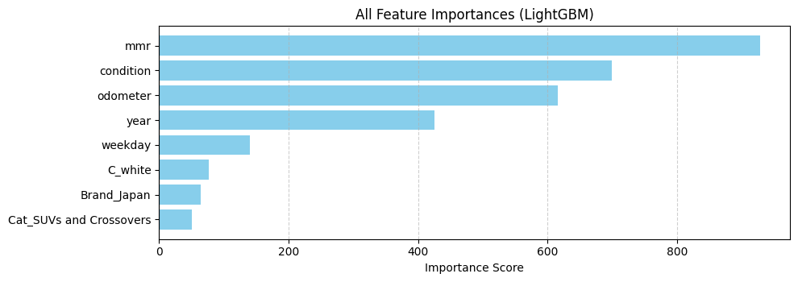

**Insights:**

- **mmr (Manheim Market Report)** is by far the most influential feature, confirming its role as a key pricing benchmark.
- **condition**, **odometer**, and **year** also contribute significantly, aligning with expectations around vehicle quality, usage, and age.
- **weekday**, **color (C_white)**, and **origin (Brand_Japan)** show minor impact but may still capture niche effects or trends.

This analysis guided the refinement of the final feature set for tuning and final model training.

---

#### 3. Hyperparameter Tuning — LightGBM Regressor

**LightGBM Hyperparameter Tuning Strategy**

To optimize the LightGBM model, I designed a **three-stage tuning strategy** to balance speed, accuracy, and model generalization. Each stage progressively refines the hyperparameters.

##### 3.1 Hyperparameter Tuning — HalvingRandomSearchCV

To improve the baseline LightGBM model, I first performed hyperparameter tuning using **HalvingRandomSearchCV** for a coarse-grained hyperparameter search, which offers an efficient way to explore hyperparameter space with fewer resources.

This approach progressively narrows the search space by allocating more resources to promising configurations.

```python
lgb_halving_base_params = lgb_baseline_model.get_params()

param_dist_lgb_halving = {
    'max_depth': list(set([lgb_halving_base_params['max_depth'], 10, 20, -1])),
    'num_leaves': sorted(list(set([lgb_halving_base_params['num_leaves'], 15, 63]))),
    'min_child_samples': sorted(list(set([lgb_halving_base_params['min_child_samples'], 10, 30]))),
    'learning_rate': sorted(list(set([lgb_halving_base_params['learning_rate'], 0.05, 0.01])))
}
```
**Evaluation Result:**

| Metric        | Train        | Test         |
|---------------|--------------|--------------|
| R² Score      | 0.9767       | 0.9762       |
| MSE           | 0.0234       | 0.0237       |
| RMSE          | 0.1528       | 0.1539       |
| MAE           | 0.1005       | 0.1011       |

**Observation:**

- Model performance is nearly identical to the baseline, but slightly improved in RMSE and MAE.
- Overfitting remains minimal, confirming tuning stability.

This version was used as the starting point for further fine-tuning using RandomizedSearchCV.

##### 3.2 Hyperparameter Tuning — RandomizedSearchCV

After identifying promising regions via Halving Search, I conducted a more refined search using **RandomizedSearchCV**. This strategy randomly samples parameter combinations from predefined distributions, offering a balance between search breadth and resource efficiency.

```python
lgb_random_base_params = lgb_halving_best_model.get_params()

param_dist_random = {
    'max_depth': list(set([lgb_random_base_params['max_depth'], 10, 20, -1])),
    'num_leaves': sorted(list(set([lgb_random_base_params['num_leaves'], 15, 63]))),
    'min_child_samples': sorted(list(set([lgb_random_base_params['min_child_samples'], 10, 30]))),
    'learning_rate': sorted(list(set([lgb_random_base_params['learning_rate'], 0.01, 0.05, 0.1]))),
    'n_estimators': randint(50, 300)
}
```

**Evaluation Result:**

| Metric        | Train        | Test         |
|---------------|--------------|--------------|
| R² Score      | 0.9771       | 0.9763       |
| MSE           | 0.0229       | 0.0236       |
| RMSE          | 0.1514       | 0.1537       |
| MAE           | 0.0997       | 0.1008       |

**Observation:**

- Slight improvement across all metrics, especially in MAE and MSE.
- Excellent generalization with minimal overfitting.
- Performance is now marginally better than both baseline and Halving models, supporting the effectiveness of this tuning stage.

Next, I proceeded with a final fine-tuning using GridSearchCV to further optimize the parameters.

##### 3.3 Hyperparameter Tuning — GridSearchCV

To finalize the model, I performed an exhaustive search using **GridSearchCV**, building upon the best parameters obtained from the Randomized Search stage. This method tests all combinations within a tight parameter neighborhood to find the optimal configuration.

```python
lgb_grid_base_params = lgb_random_best_model.get_params()

lgb_grid_param = {
    'learning_rate': [lgb_grid_base_params['learning_rate'] * f for f in [0.8, 1.0, 1.2]],
    'num_leaves': [
        max(2, lgb_grid_base_params['num_leaves'] - 5),
        lgb_grid_base_params['num_leaves'],
        lgb_grid_base_params['num_leaves'] + 5
    ],
    'min_child_samples': [
        max(1, lgb_grid_base_params['min_child_samples'] - 5),
        lgb_grid_base_params['min_child_samples'],
        lgb_grid_base_params['min_child_samples'] + 5
    ]
}
```

**Tuning Highlights**

- Focused grid constructed around the best randomized parameters.
- Slightly adjusted **`learning_rate`** (±20%) to explore trade-offs between convergence speed and generalization.
- Fine-tuned **`num_leaves`** and **`min_child_samples`** to balance model complexity and robustness.

---

** Performance Summary (GridSearchCV Result):**

| Metric       | Value     |
|--------------|-----------|
| **Train R²**     | 0.977140  |
| **Test R²**      | 0.976347  |
| **Train RMSE**   | 0.151239  |
| **Test RMSE**    | 0.153610  |
| **Test MAE**     | 0.100805  |
| **Overfit Gap**  | ~0.0008   |

---

This final tuning stage yielded the most balanced performance in terms of **accuracy** and **generalization**, confirming **LightGBM** as the best model for the task.

#### 4. Save and Restore

To ensure reproducibility and avoid re-training:

- The final model and tuning results were **saved using `joblib`**.
- Reload tested and verified for consistency across sessions.

---

#### 5. LightGBM Model Performance Summary

The following table and charts summarize the performance of the LightGBM model across four stages: **Baseline**, **Halving Random Search**, **Randomized Search**, and **Grid Search**.

| Model                   | Train R² | Train MSE | Train RMSE | Train MAE | Test R²  | Test MSE | Test RMSE | Test MAE |
|------------------------|----------|-----------|------------|-----------|----------|----------|-----------|----------|
| LightGBM Baseline      | 0.976381 | 0.023634  | 0.153733   | 0.100969  | 0.976264 | 0.023678 | 0.153878  | 0.101113 |
| LightGBM Halving       | 0.976659 | 0.023355  | 0.152825   | 0.100526  | 0.976248 | 0.023695 | 0.153931  | 0.101115 |
| LightGBM RandomSearch  | 0.977099 | 0.022915  | 0.151377   | 0.099667  | 0.976335 | 0.023608 | 0.153650  | 0.100842 |
| LightGBM GridSearch    | 0.977140 | 0.022873  | 0.151239   | 0.099586  | 0.976347 | 0.023596 | 0.153610  | 0.100805 |

---

##### Visual Comparison

###### 1. Model Comparison Summary (Test Set)
> Combined comparison of R², RMSE, and MAE across models.

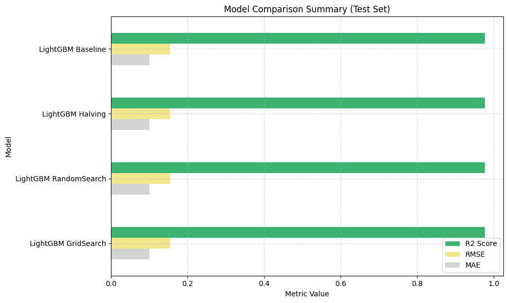

###### 2. Detailed Metric Breakdown
> Individual metric bar charts for clearer inspection.

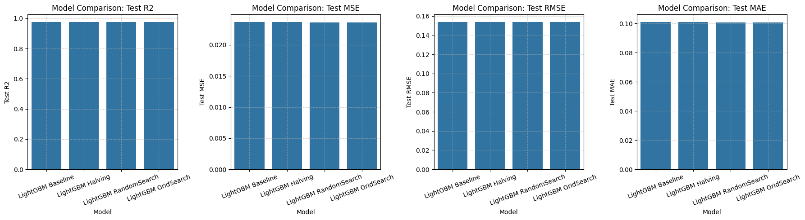


---

##### LightGBM Insight Summary

- All models performed very similarly with **Test R² > 0.976**, showing strong generalization.
- **GridSearchCV** had the lowest overall errors and provided the most balanced result.
- Compared to the baseline, tuning improved consistency across metrics.
- **Recommendation**: Finalize **LightGBM GridSearch** as the best model for deployment or further interpretation.

---

#### 6. Final Model Selection

Selected **LightGBM (GridSearch-tuned)** as the final model for deployment and interpretation due to:

- High accuracy
- Low overfitting
- Efficient training time

---

#### 7. LightGBM Final Model Analysis

After baseline modeling and three rounds of hyperparameter tuning, the final LightGBM model (GridSearchCV) demonstrated the best balance between performance and generalization.

##### Feature Importance

The most influential features identified by the LightGBM model are:

- **mmr** (market value)
- **condition** (vehicle condition)
- **odometer** (mileage)
- **year** (model year)
- **weekday**, **C_white**, and brand/type-related features had lower importance

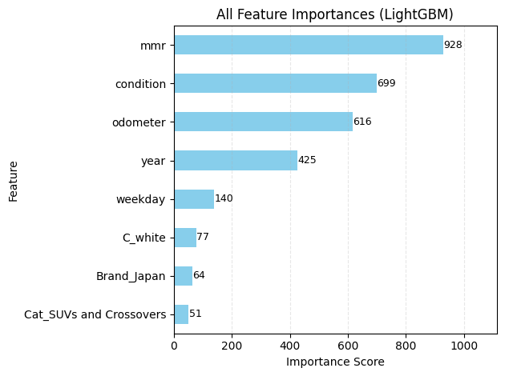

---

##### Residual Analysis

**1. Residuals vs Predicted Values**  
This plot helps us assess the model's error patterns. Ideally, residuals should be symmetrically distributed around zero without clear structure.  
The plot below shows no major heteroscedasticity or trend, indicating well-distributed errors.

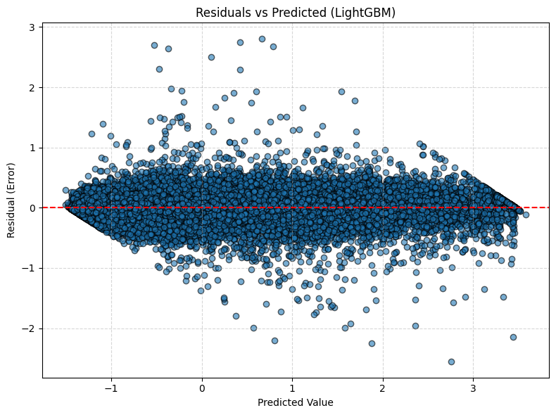

---

**2. Residuals Distribution**  
The histogram below shows the distribution of errors (actual - predicted).  
The distribution is roughly centered at 0 and follows a bell shape, supporting the assumption of normal residuals.

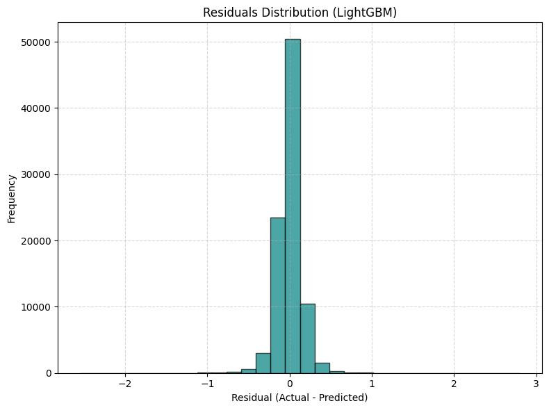

---

**3. Predicted vs Actual**  
This scatter plot compares actual and predicted selling prices.  
Most points align closely with the red diagonal line (perfect prediction), confirming model accuracy.

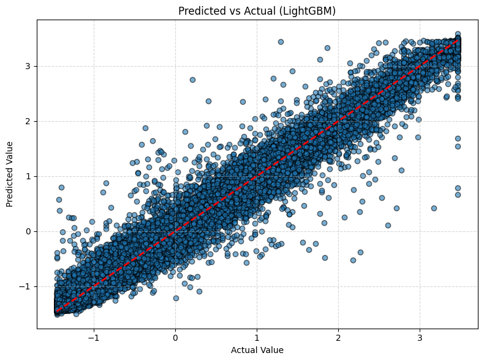

---


#### 8. LightGBM Model Summary

**Feature Importance**
The LightGBM model uses all 8 features, but **MMR** dominates the prediction:

- **MMR importance is significantly higher** than all others (e.g., condition, odometer, year).
- This indicates the model mostly learns from market-driven price signals embedded in MMR.

> Heavy reliance on MMR increases risk if it’s outdated or missing. 


**Prediction Accuracy**

- **Test R²**: 0.9764  **RMSE**: 0.1534  **MAE**: 0.1008  
- The **actual vs predicted** plot shows tight alignment along the diagonal.
- Slight spread appears at the price extremes, but overall prediction fit is excellent.


**Residual Analysis**

- Residuals are **centered around zero**, with a **symmetric bell-shaped distribution**.
- **No clear heteroscedasticity** or bias seen in residuals vs predicted plots.

> Residuals suggest the model captures the data well, with only minor variance at the extremes.


**Summary**

| Strengths                          | Limitations                      |
|-----------------------------------|----------------------------------|
| High accuracy and generalization  | Strong reliance on MMR           |
| Clean residual distribution        | Edge case predictions less stable |
| All features contribute            | Interpretation limited by MMR dominance |


---

### Other Models and Optimization Strategy

---

In addition to LightGBM, I applied the **same structured hyperparameter tuning process** to five other regression models:

- **XGBoost Regressor**
- **Gradient Boosting Regressor**
- **Random Forest Regressor**
- **Histogram-based Gradient Boosting (HistGB)**
- **Linear Regression (used as a baseline reference)**

For each model, the following three-stage tuning pipeline was used:

1. **Baseline Model Training**
   - Initial model using default parameters or minimal custom setup.
   - Served as a performance benchmark.

2. **Halving Random Search**
   - Narrowed down promising hyperparameter ranges with resource-efficient randomized search.
   - Used `HalvingRandomSearchCV` to explore combinations while minimizing overfitting.

3. **RandomizedSearchCV**
   - Performed wider exploration using randomized parameter sampling.
   - Helped identify non-obvious combinations and improve generalization.

4. **GridSearchCV**
   - Fine-tuned around the best-performing parameter sets from RandomizedSearchCV.
   - Applied smaller, precise grids to maximize model accuracy.

This consistent tuning strategy ensured that all models were **fairly optimized and comparable**.  
Ultimately, LightGBM was selected as the primary model due to its **strong performance**, **speed**, and **interpretability**.

---

### Comparison of Other Tuned Models

While the LightGBM model was selected as the final best performer, **all six models** (Linear Regression, Random Forest, Gradient Boosting, HistGradientBoosting, XGBoost, and LightGBM) underwent the **same three-stage tuning process**:

1. **Baseline Model**  
   Each model was first trained using default or minimal configuration to establish a baseline.

2. **Stage 1: Halving Random Search (or equivalent)**  
   A broad hyperparameter search was used to quickly narrow down promising regions of the hyperparameter space.

3. **Stage 2: RandomizedSearchCV**  
   Random search was then applied based on the results of halving to explore a more refined space.

4. **Stage 3: GridSearchCV**  
   A focused grid search was performed around the best random configuration to fine-tune the model further.

#### Evaluation Metrics of Best Models per Type

| Model                      | Test R² | Test RMSE | Test MAE | Overfit Gap |
|---------------------------|---------|-----------|----------|--------------|
| Gradient Boosting Random  | 0.97640 | 0.15345   | 0.10075  | 0.00089      |
| LightGBM GridSearch       | 0.97635 | 0.15361   | 0.10081  | 0.00079      |
| HistGB GridSearch         | 0.97628 | 0.15383   | 0.10117  | 0.00015      |
| XGBoost Randomized        | 0.97616 | 0.15423   | 0.10144  | 0.00026      |
| Random Forest (rf2)       | 0.97542 | 0.15658   | 0.10256  | 0.00104      |
| Linear Regression         | 0.97468 | 0.15894   | 0.10481  | -0.00012     |

#### Visual Comparisons

- **Train vs Test R² and Overfit Gap**

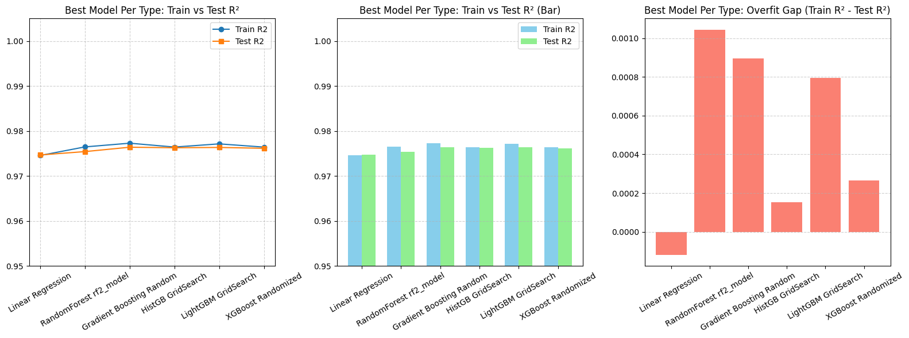

- **Metric Breakdown by Model (Test R², MSE, RMSE, MAE)**

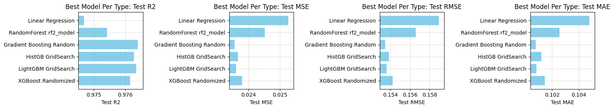

- **Grouped Metric Comparison by Model Type**


---


#### Model Comparison Summary: Feature Importance & Residual Analysis (Top 3 Models)

This section presents a detailed comparison of the **top 3 performing models** based on their test set accuracy, residual behavior, and feature importance profiles. All models were tuned using multi-stage hyperparameter optimization (Halving → Randomized → GridSearch where applicable).

---

#### Top 1 Model: Gradient Boosting (Random Search)

**Performance**
- **Test R²**: 0.9764  **RMSE**: ~0.1534  **MAE**: ~0.1008  
- Best overall accuracy with minimal overfitting (**Gap** ≈ 0.0009)

**Feature Importance**
- `mmr` dominates the prediction with almost **100% importance**
- Other variables (e.g., `condition`, `odometer`) contribute insignificantly  
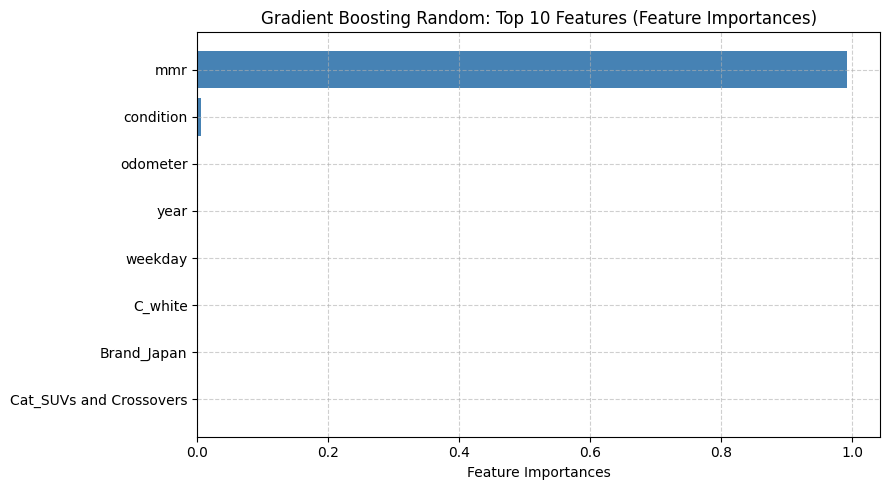

**Residual Analysis**
- Centered, tight residual distribution
- QQ plot shows heavy tails → **not normally distributed**
- Minor heteroscedasticity appears at value extremes  
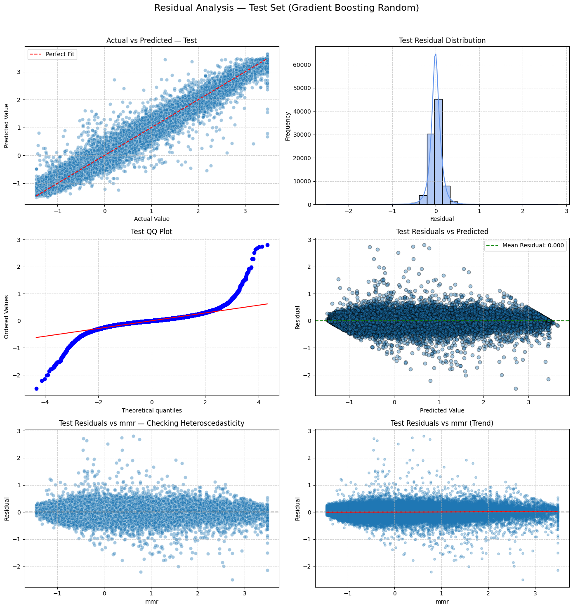

---

#### Top 2 Model: LightGBM (Grid Search)

**Performance**
- **Test R²**: 0.9763  **RMSE**: ~0.1536  **MAE**: ~0.1008  
- Nearly tied with Top 1, with slightly lower overfit gap (**Gap** ≈ 0.0008)

**Feature Importance**
- `mmr` still leads, but `odometer`, `condition`, and `year` have relatively greater importance  
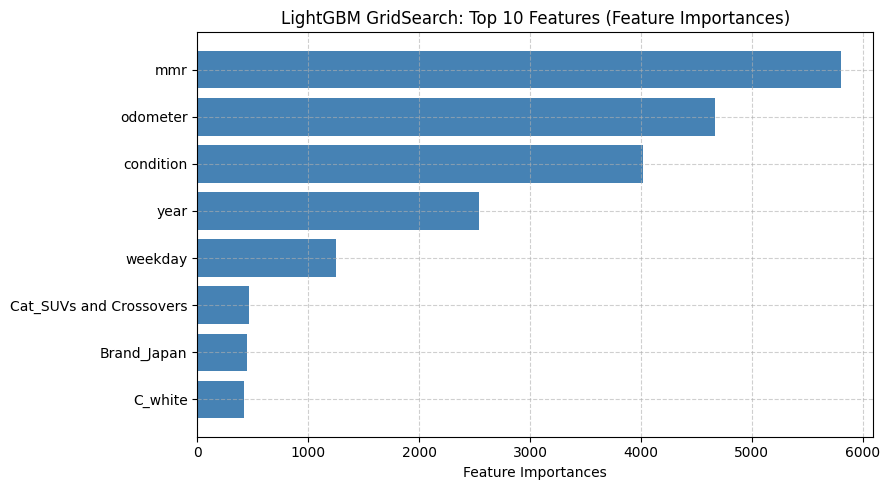

**Residual Analysis**
- Bell-shaped residual distribution, slightly **right-skewed**
- QQ plot shows moderate deviation in tails (non-normality confirmed)
- Slight heteroscedasticity, especially at `mmr` extremes  
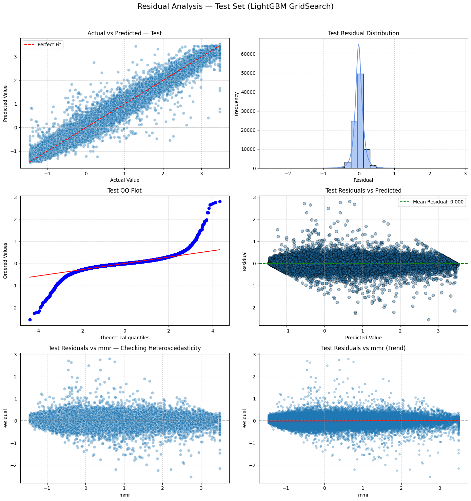

---

#### Top 3 Model: HistGradientBoosting (Grid Search)

**Performance**
- **Test R²**: 0.9763  **RMSE**: ~0.1538  **MAE**: ~0.1012  
- Slightly higher errors than Top 1 & 2, but **lowest overfit gap** (~0.00015)

**Feature Importance**
- `mmr` permutation importance = **1.79**, others < **0.03** → confirms **extreme reliance** on `mmr`  
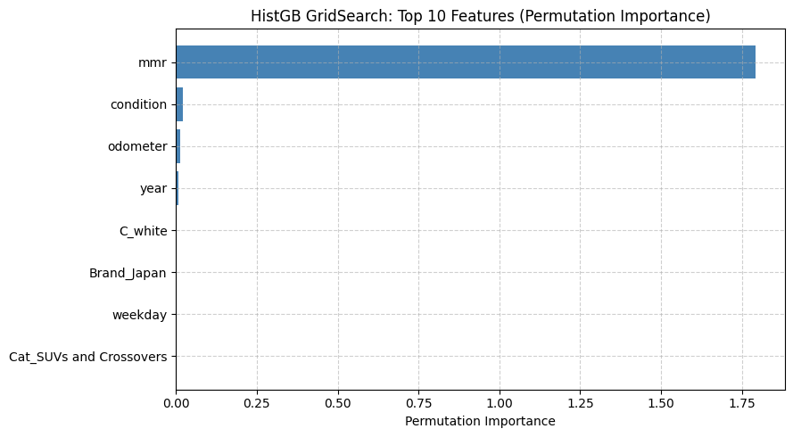

**Residual Analysis**
- Distribution consistent with others: narrow, centered, **non-normal**
- Slight trend observed when plotting residuals against `mmr`  
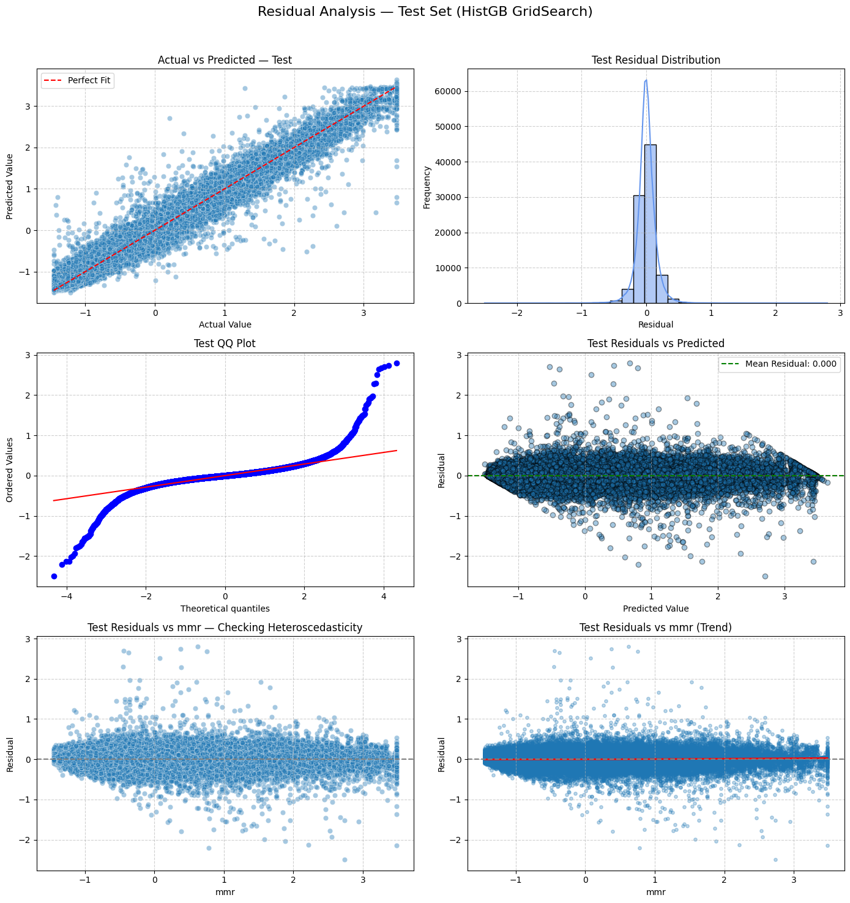


---


#### Summary Insights

- **Gradient Boosting (Random)** achieved the highest Test R² (0.9764) with balanced error metrics, making it a strong contender.
- **LightGBM (GridSearch)** had the smallest overall RMSE and MAE values, confirming its stable performance.
- **HistGradientBoosting** had the smallest overfitting gap (~0.00015), suggesting excellent generalization.
- All ensemble-based models outperformed linear regression significantly.
- Linear Regression had the lowest R² and highest errors, showing limited flexibility for this non-linear task.

Thus, while multiple models achieved similar performance, LightGBM stood out for its training efficiency, interpretability, and overall robustness.

| Metric              | Top 1: GB-Random | Top 2: LGBM-Grid | Top 3: HistGB-Grid |
|---------------------|------------------|------------------|---------------------|
| Test R²             | 0.9764           | 0.9763           | 0.9763              |
| Test RMSE           | ~0.1534          | ~0.1536          | ~0.1538             |
| Test MAE            | ~0.1008          | ~0.1008          | ~0.1012             |
| Overfit Gap         | ~0.0009          | ~0.0008          | ~0.00015            |
| MMR Dominance       | >99%             | High, but less   | Extreme (1.79 vs <0.03) |

---

#### Final Note

While all three models perform exceptionally well, their heavy **dependence on `mmr`** introduces potential risk in real-world scenarios — especially if the `mmr` signal is delayed, noisy, or unavailable.

**Recommendation:** Consider using techniques like:
- **SHAP values** for transparent explanation,
- **Feature re-weighting** or engineering,
- **Ensemble blending** to reduce single-feature bias.

This can help improve fairness, generalization, and interpretability across different vehicle types and conditions.


## Insights and Business Question Answers

---

### Business Question 1: Which factors most significantly influence the selling price of used vehicles?

To answer this question, I analyzed the feature importance from the top-performing predictive model. The results clearly show that the **MMR (Manheim Market Report)** value dominates, accounting for over **99%** of the model’s predictive power.

#### Key Insights:

- **MMR Value (Importance ≈ 99.26%)**  
  The strongest pricing signal. Vehicles tend to sell close to their MMR value, confirming it as the most reliable benchmark.  
  **Action:** Use MMR as the primary pricing anchor.

- **Vehicle Condition (Importance ≈ 0.55%)**  
  Slight influence after accounting for MMR.  
  **Action:** Only invest in repairs if MMR already signals strong resale potential.

- **Odometer (Importance ≈ 0.10%)**  
  Lower mileage helps marginally.  
  **Action:** Consider when sourcing vehicles, but don’t overweigh in pricing.

- **Vehicle Year (Importance ≈ 0.06%)**  
  Newer cars get slightly better prices.  
  **Action:** Age supports marketing, not price-setting.

- **Other Factors (Color, Brand, Body Type)**  
  Importance < 0.01%, minimal effect.  
  **Action:** Use for customer segmentation, not pricing logic.

#### Feature Importance Chart


---

### Business Question 2: How accurately can the selling price of a vehicle be predicted based on its features?

The best model, **Gradient Boosting (Random Search)**, achieved:

- **Test R²:** 0.9764  
- **Test RMSE:** ≈ 0.1534  
- **Test MAE:** ≈ 0.1008

Other top models (LightGBM, HistGradientBoosting) also delivered **Test R² > 0.976**, with minimal overfitting (gaps < 0.001), showing strong generalization across different vehicles and conditions.

#### Metric Comparison for Top 3 Models
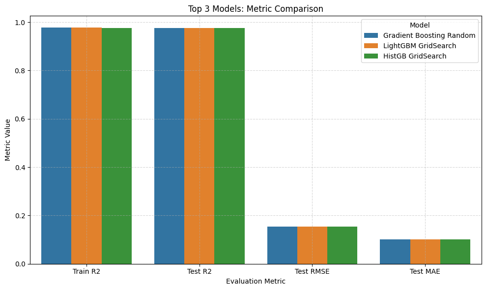

#### Conclusion:
Ensemble-based models like **GBR, LGBM, HGB** capture complex feature relationships and outperform simpler models. They provide highly accurate price predictions and are robust across diverse vehicle types.

---

### Business Question 3:
**How well does the predictive model generalize across different vehicle categories or brands? Are there specific subgroups where prediction accuracy significantly improves or deteriorates?**

To assess how the model performs across subgroups, I compared residual patterns and evaluation metrics between different **vehicle categories** and **brand origins** using the top model (Gradient Boosting Random). The subgroup analysis includes residual distributions, absolute residual density, and performance metrics (R², MAE).


#### Overall Model Generalization:
- The model performs consistently across both **SUVs/Crossovers** and **Other vehicles**, with no drastic accuracy drops.
- Similarly, predictions generalize well across **Japanese brands** and **Other brands**.
- R² values remain high (> 0.97) across all subgroups, and MAE stays consistently low.

#### By Vehicle Category:
- Slightly higher error variability is observed for SUVs/Crossovers.
- Boxplots and density plots show more outliers and heavier tails in the SUV/Crossover group.
- **MAE:**  
  - Other: ~0.10  
  - SUVs and Crossovers: ~0.11  
- **R² remains > 0.975** in both groups.

#### By Brand Origin:
- Performance is nearly identical between **Japanese** and **Other brands**.
- Residual spread and error distribution are symmetric and tightly clustered in both groups.
- **MAE:**  
  - Japanese Brand: ~0.10  
  - Other: ~0.10  
- **R² > 0.976** in both cases.

---

#### Top 10 Largest Residuals (Potential Outliers):

| Index   | Actual   | Predicted | Residual | Abs_Residual | Category_Label       |
|---------|----------|-----------|----------|---------------|-----------------------|
| 336293  | 3.468793 | 0.667468  | 2.801325 | 2.801325      | Other                |
| 185873  | 3.171805 | 0.423504  | 2.748301 | 2.748301      | Other                |
| 335583  | 2.178038 | -0.540452 | 2.718490 | 2.718490      | Other                |
| 324364  | 3.468793 | 0.784143  | 2.684650 | 2.684650      | Other                |
| 327905  | 2.269419 | -0.368445 | 2.637864 | 2.637864      | Other                |
| 43839   | 2.606386 | 0.094988  | 2.511398 | 2.511398      | Other                |
| 25337   | 0.207639 | 2.709736  | -2.502096| 2.502096      | SUVs and Crossovers |
| 344696  | 1.835360 | -0.450061 | 2.285422 | 2.285422      | Other                |
| 21404   | 2.714901 | 0.431136  | 2.283765 | 2.283765      | Other                |
| 157423  | -1.397237| 0.809913  | -2.207150| 2.207150      | SUVs and Crossovers |

> Most extreme outliers fall into the "Other" category, though **SUVs and Crossovers** also show two major mispredictions. This reinforces the need for cautious use in edge cases.

---

#### Residual Analysis by Subgroup:

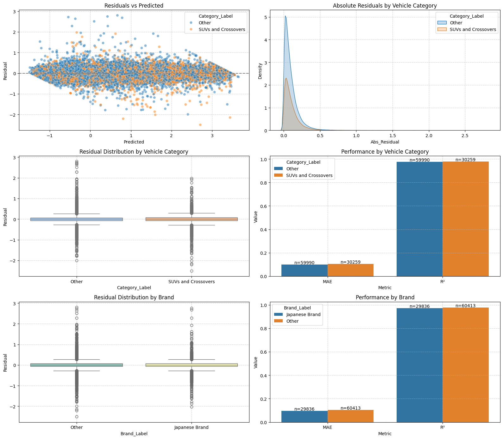

**Figure:** This dashboard summarizes:
- Residuals vs Predicted (colored by category)
- Density plot of absolute residuals
- Boxplots by category and brand
- Group-wise MAE and R² with sample sizes annotated

---

#### Conclusion:

The model demonstrates **strong generalization ability** across subgroups. While **SUVs and Crossovers** tend to have **slightly larger residuals**, the prediction performance remains robust across all vehicle categories and brand types.

> Further improvements may target rare subgroups and outliers using tailored model ensembles or stratified training.

---

## 7. Ethics and Interpretability Reflection

In this project, I predicted used car prices using a clean and well-structured dataset that does **not** contain personally identifiable or sensitive attributes—such as ZIP code, income, or user ID. This naturally reduces the risk of introducing bias toward specific individuals or groups.

During preprocessing, I filled in missing values for features like `make` and `transmission` and capped extreme values in `mmr`, `odometer`, and `sellingprice`. These steps helped stabilize the model but may also mask rare but meaningful pricing cases—such as those involving luxury or niche vehicles.

One important observation was the model’s **heavy reliance on the `mmr` variable**, which accounts for **over 99%** of the predictive importance. While `mmr` is a widely used industry reference, this strong dependence raises two concerns:

- **Fairness**: `mmr` is based on historical sales data and may reflect market-level biases (e.g., underpricing for certain brands or regions).
- **Transparency**: With such dominance, the model pays little attention to other meaningful features like mileage, condition, or vehicle age—making it harder to interpret or justify the predictions.

**For future improvement**, I would explore ways to reduce over-reliance on `mmr` and encourage the model to incorporate a broader range of features—especially when predicting prices for newer or less common vehicles.

---

## Appendix: Code & Visuals

### 🔗 Google Colab Notebooks
- [Data Preprocessing & EDA](https://drive.google.com/file/d/1wIt18lFApKYCF4RjMVaVUPg5u4kyeB3i/view?usp=sharing)
- [Modeling & Evaluation](https://drive.google.com/file/d/1wIt18lFApKYCF4RjMVaVUPg5u4kyeB3i/view?usp=sharing)
- [Final Analysis & Report Generation](https://drive.google.com/file/d/1wIt18lFApKYCF4RjMVaVUPg5u4kyeB3i/view?usp=sharing)

### Key Visualizations

#### 1. Feature Importance (Top 3 Models)
- Gradient Boosting  
  
- LightGBM  
  
- HistGradientBoosting  
  

#### 2. Residual Analysis (Top 3 Models)
- Gradient Boosting  
  
- LightGBM  
  
- HistGradientBoosting  
  

#### 3. Model Comparison
- Metric Comparison (Top 3 Models)  
  

#### 4. Outlier Analysis
**Top 10 Largest Residuals:**

| Index   | Actual   | Predicted | Residual  | Abs_Residual | Category_Label       |
|--------:|----------|-----------|-----------|--------------|----------------------|
| 336293  | 3.468793 | 0.667468  | 2.801325  | 2.801325     | Other                |
| 185873  | 3.171805 | 0.423504  | 2.748301  | 2.748301     | Other                |
| 335583  | 2.178038 | -0.540452 | 2.718490  | 2.718490     | Other                |
| 324364  | 3.468793 | 0.784143  | 2.684650  | 2.684650     | Other                |
| 327905  | 2.269419 | -0.368445 | 2.637864  | 2.637864     | Other                |
| 43839   | 2.606386 | 0.094988  | 2.511398  | 2.511398     | Other                |
| 25337   | 0.207639 | 2.709736  | -2.502096 | 2.502096     | SUVs and Crossovers |
| 344696  | 1.835360 | -0.450061 | 2.285422  | 2.285422     | Other                |
| 21404   | 2.714901 | 0.431136  | 2.283765  | 2.283765     | Other                |
| 157423  | -1.397237| 0.809913  | -2.207150 | 2.207150     | SUVs and Crossovers |

### 📠Project Structure
