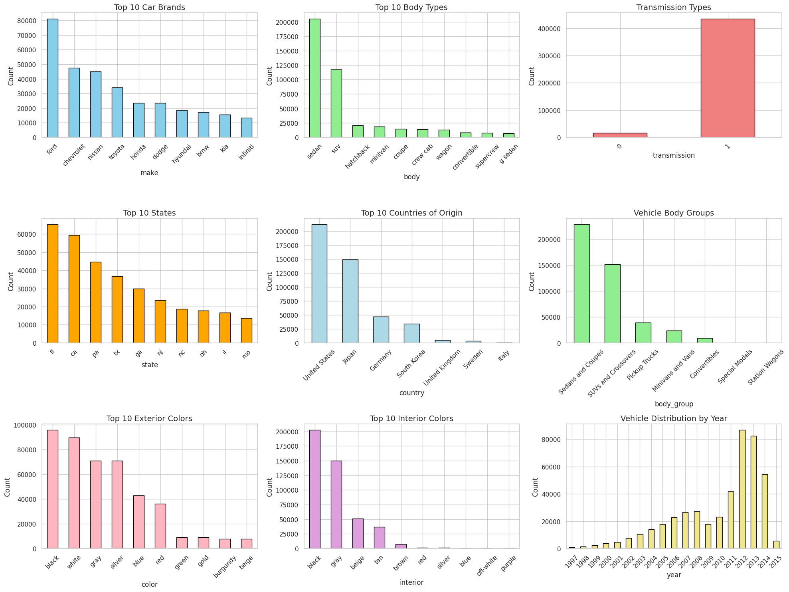

## 🚗 Predictive Modeling for Used Car Pricing
> ——*A Machine Learning Project*

---

## 📌 Project Overview  

This project applies machine learning to help used car dealerships optimize pricing strategies.  
Using a comprehensive dataset of historical vehicle transactions, the objective is to develop predictive models that estimate the fair market value of a used car based on key features, including:

- Make, model, and year  
- Condition and odometer reading  
- Manheim Market Report (MMR) value  
- Final selling price  

By leveraging supervised regression techniques, the project aims to identify the most influential pricing factors, evaluate model accuracy, and assess generalizability across different vehicle categories. The ultimate goal is to provide actionable insights to support data-driven pricing and inventory decisions.

## 🎯 Expected Outcomes

- **Identify the most influential features**—such as MMR, condition, and odometer—that drive used vehicle pricing decisions.
- **Build and evaluate high-performing ML models** (e.g., XGBoost, LightGBM) to accurately predict vehicle selling prices with minimal error.
- **Assess model fairness and generalization** across key subgroups (e.g., SUVs vs. others, Japanese vs. non-Japanese brands), ensuring pricing models are reliable and unbiased.
- **Provide data-driven recommendations** to support smarter pricing, inventory sourcing, and model deployment in real-world business settings.

## Dataset Overview

The dataset used in this project is the **"Vehicle Sales and Market Trends Dataset"**, originally published on [Kaggle](https://www.kaggle.com/datasets/syedanwarafridi/vehicle-sales-data/data). It contains detailed information on **558,837** used vehicle transactions, with **16 columns** describing each vehicle's specifications, condition, market benchmarks, and final selling price.

This real-world dataset provides a strong foundation for building predictive machine learning models to estimate used car prices — a task of direct business relevance to auto dealers, resale platforms, and pricing analysts.

### Dataset Summary

| Attribute                    | Value                    |
|-----------------------------|--------------------------|
| 📁 Dataset Name             | Vehicle Sales and Market Trends |
| 🔢 Number of Rows           | 558,837                  |
| 🔠 Number of Columns        | 16                       |
| 🧾 File Format              | CSV                      |
| 🔁 Update Frequency         | Periodically             |
| ✅ Data Integrity           | Reasonable quality, but further validation recommended |

### Dataset Features

The dataset includes a wide range of attributes that influence vehicle valuation:

- **Vehicle Details**: `make`, `model`, `year`, `trim`, `body type`, `transmission`, `VIN`
- **Condition & Mileage**: `condition`, `odometer`, `exterior_color`, `interior_color`
- **Transaction Info**: `sellingprice`, `date`, `state`, `seller`
- **Market Benchmark**: `mmr` (Manheim Market Report), which provides an industry pricing baseline

| **Column**       | **Description**                                                                 |
|------------------|----------------------------------------------------------------------------------|
| `year`           | Year of the vehicle                                                             |
| `make`           | Manufacturer brand (e.g., BMW, Toyota)                                          |
| `model`          | Specific model name                                                             |
| `trim`           | Trim level                                                                      |
| `body`           | Body type (e.g., SUV, Sedan)                                                    |
| `transmission`   | Transmission type (manual or automatic)                                         |
| `condition`      | Numeric condition rating (subjective or appraised)                              |
| `odometer`       | Mileage reading at time of sale                                                 |
| `color`          | Exterior color                                                                  |
| `interior`       | Interior color                                                                  |
| `seller`         | Selling party or dealer name                                                    |
| `mmr`            | Manheim Market Report value (benchmark vehicle price)                           |
| `sellingprice`   | Final sale price of the vehicle                                                 |
| `saledate`       | Timestamp of the sale transaction                                               |

### Summary Statistics

| Metric                     | Value     |
|---------------------------|-----------|
| Number of rows            | 558,837   |
| Number of columns         | 16        |
| Mean vehicle year         | 2010.0    |
| Mean odometer             | 68,320    |
| Mean condition            | 30.67     |
| MMR (avg)                 | $13,769   |
| Selling Price (avg)       | $13,611   |

### Sample Data Variety

Below are a few randomly sampled entries from different years, states, and sellers to illustrate the dataset’s diversity:

| year | make   | model     | state | condition | odometer | mmr   | sellingprice |
|------|--------|-----------|-------|-----------|----------|-------|---------------|
| 2013 | Ford   | Escape    | TX    | 4.0       | 17,098   | 16400 | 16700         |
| 2002 | Nissan | Sentra    | FL    | 36.0      | 85,538   | 1900  | 2500          |
| 2012 | Kia    | Optima    | PA    | 47.0      | 33,002   | 14500 | 15300         |
| 2011 | BMW    | 3 Series  | NJ    | 44.0      | 37,196   | 19650 | 18800         |

### Why This Dataset?

This dataset was selected for the following reasons:

- **Practical Business Relevance**: Used car pricing is a key challenge in auto sales and inventory management.
- **Rich Feature Set**: Includes both vehicle-level details and market-level signals (e.g., MMR).
- **Real-World Scale**: With over half a million records, it supports robust training, validation, and generalization.
- **Model Interpretability**: The presence of interpretable features like condition, mileage, and brand enables clear insights from ML models.

### Potential Use Cases

- ** Market Analysis**: Track pricing trends by year, region, or vehicle type.
- ** Predictive Modeling**: Build regression models to estimate car values.
- ** Business Strategy**: Support pricing, sourcing, and resale decisions with data-driven insights.
- ** Customer Profiling**: Understand patterns in buying behavior or vehicle depreciation.

### Project Relevance

This project applies supervised regression techniques to:

- Predict the **selling price** of a used vehicle based on its attributes
- Identify the **key drivers** of price variation (e.g., MMR, condition, mileage)
- Evaluate model performance across different **vehicle subgroups** (e.g., by category or brand)

The ultimate goal is to deliver actionable insights that support smarter, data-driven decisions for **used car dealerships** and **resale platforms**.

## Exploratory Data Analysis (EDA)

### Categorical Feature Distributions

The following chart presents the frequency distributions of key categorical features in the dataset:

#### Key Takeaways:

- **Make**: Ford, Chevrolet, and Nissan are the most frequently listed brands, representing a large portion of the dataset.
- **Body Type**: Sedans and SUVs dominate the vehicle body types, while coupes, convertibles, and wagons are less common.
- **Transmission**: Most vehicles use automatic transmission, suggesting potential simplification in modeling.
- **State**: Florida and California contribute the most records, indicating possible regional market trends.
- **Country of Origin**: Vehicles from the U.S. and Japan lead the dataset, with Germany a distant third.
- **Exterior & Interior Colors**: Black, white, and gray are dominant for both exterior and interior colors, suggesting consumer preferences.
- **Year Distribution**: The bulk of the vehicles were manufactured between 2010 and 2015, reflecting recency in resale activity.

These distributions provide important context for understanding the dataset composition and help inform preprocessing steps (e.g., rare category consolidation).

### Distribution of Key Numerical Variables

- **Selling Price**: Right-skewed; most cars are priced between \$5,000 and \$20,000, with a long tail above \$100,000.
- **Odometer**: Positively skewed; most vehicles have mileage under 100,000 miles, but some outliers exceed 900,000.
- **MMR (Market Benchmark Price)**: Also right-skewed, with values typically between \$5,000 and \$25,000.

---

### Top Vehicle Attributes (Categorical)

- **Top Makes**: Ford, Chevrolet, Nissan, Toyota, Honda.
- **Top Body Types**: Sedans and SUVs dominate.
- **Transmission Types**: Majority are automatic.
- **Top States**: FL, CA, PA, TX have the most listings.

> 📊 *See Figure 2 for categorical distributions (brand, body type, state, transmission).*

---

### 1. Variable Distributions

- **Vehicle Year**: Most vehicles are manufactured between 2007 and 2015, with a peak around 2012.
- **Condition**: While condition is numeric, it's not a typical 1–5 scale; values range widely, suggesting different rating schemes from various sellers.
- **Odometer**: Positively skewed; many vehicles cluster under 100,000 miles, but some outliers reach nearly 1,000,000 miles.
- **Selling Price**: Right-skewed distribution; majority of cars sold between \$5,000 and \$20,000, but luxury vehicles can exceed \$100,000.

> 📊 *Included plots: histograms for year, condition, odometer, and sellingprice.*

---

### 2. Correlations and Relationships

- **MMR vs Selling Price**: Strong positive correlation observed. MMR is a reliable price anchor, confirming its predictive value.
- **Odometer vs Selling Price**: As expected, higher mileage tends to reduce the vehicle’s selling price.
- **Condition vs Selling Price**: Better condition is associated with higher prices, though with more variance than expected.

> 📈 *Included visuals: scatter plots and heatmap of correlations among numeric variables.*

---

### 3. Categorical Breakdown

- **Body Type**: Sedans and SUVs dominate the dataset. Average selling price is higher for SUVs.
- **Brand Analysis**: Japanese brands (Toyota, Honda, Nissan) generally show tighter price distributions and lower average error rates in modeling (see later sections).
- **Seller Insights**: A few major sellers (e.g., financial institutions) account for most listings; price variance is lower among institutional sellers.

> 📊 *Included plots: bar charts for body types, sellers, and average price per brand.*

---

### 4. Missing Data Analysis

- **Transmission**: ~11% missing
- **Condition**: ~2% missing
- **Body/Trim/Model**: Some inconsistencies and null values exist but affect <5% of entries

> ✅ Missing values handled later during preprocessing via imputation or removal.

---

### 5. Outlier Detection

- **MMR, Selling Price, and Odometer** contain extreme values (e.g., prices over \$200,000; odometers close to 1,000,000).
- Outliers detected using IQR and capped at 1st–99th percentile range to reduce skew without removing rows.

> 📦 *Visuals: boxplots and before/after capping distributions.*

---

### Summary of Key Findings

- The dataset is rich, but contains noise and outliers, which need careful preprocessing.
- MMR, odometer, and condition are strong predictors for price.
- Sedans and SUVs dominate the market, with SUVs commanding higher average prices.
- Japanese brands tend to show more consistent pricing behavior.

